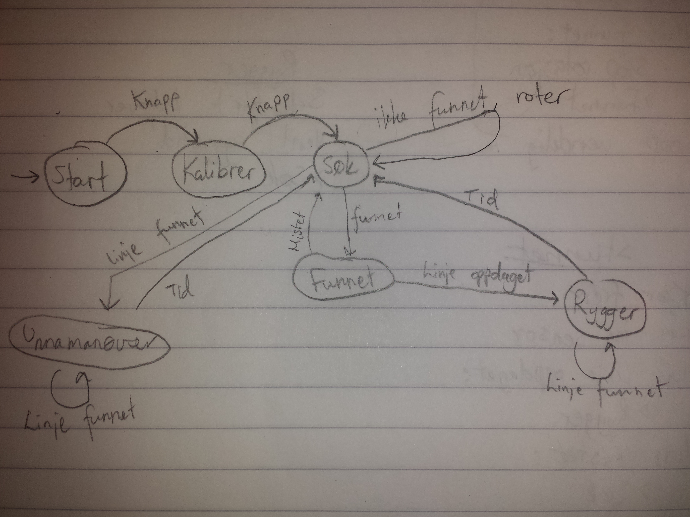

# Dora
Dora the explorer!

# Taktikk 

* Hastighet  
 * Finn motstanderen raskt  
 * Beveg deg raskt  
* Oversikt  
 * Vit om du er ved streken  
 * Vit hvor motstanderen er  
 * Vit om man blir dyttet  
 

# Statistikk

### Rotasjon
(-250, 250) : 1s på 360
(-300, 300) : 0.86 på 360

### Dytting 
400 gir litt hopping, men funker greit


--------------------

# Tilstander og pseudokode

### Tilstander  

| Tilstand    | Input                             |
|-------------|-----------------------------------|
| Start       | Knapp                             |
| Kalibrer    | knapp                             |
| Søk         | funnet, ikke funnet, linje funnet |
| Funnet      | mistet, linje funnet              |
| Unnamanøver | tid, linje funnet                 |  



### Pseudokode  

> \# er metode, > er tilstand.  

**>Start**  
```
	Sett fart 0
    Hvis knapp:
    >Kalibrer
```

**>Kalibrer**  
```
Sett fart 0
begin: Roter litt
Kalibrer sensor
Loop x ganger fra 'begin'
Hvis knapp:
    >Søk
```

**>Søk**  
```
Sett fart 0
begin: Les inn sensor
Tolk data
Hvis linje funnet:
	>Unnamanøver
Hvis funnet:
    Stop rotasjon
    >Funnet
Loop uendelig fra 'begin'
```

**>Funnet**  
```
Sett fart frem
Les inn sensor
Hvis linje oppdaget:
	>Rygger
Hvis mistet:
	>Søk
Juster retning
```

**>Rygger**  
```
Sett fart bakover
Vent 'ryggetid'
>Søk
```

**>Unnamanøver**  
```
Les inn sensor
Finn siden linjen er nermest
Rygg bakover, størst fart bakover på siden som linjen er på
```

**#Roter**
```
Hvis bil er sett tidligere:
	sett 'retinng' til den siden bilen ble sett
Ellers:
	sett retning 'høyre'
Start rotering i 'retning'
>Søk
```
